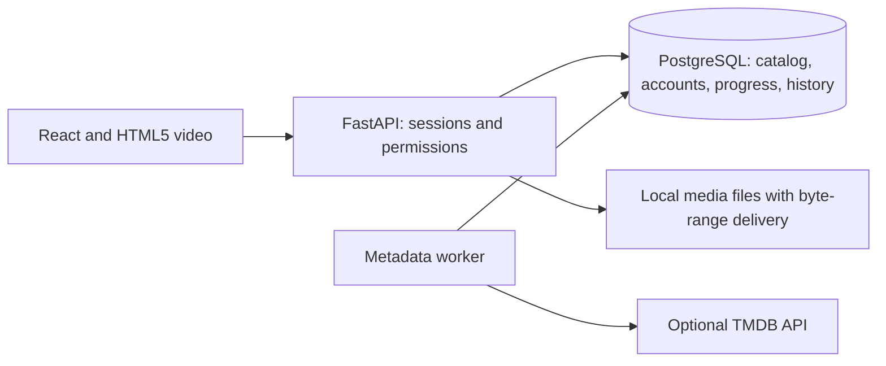

# STREAM — local multimedia library

A React + FastAPI + PostgreSQL application for a presentation and conference demo.
It plays browser-compatible local videos, searches a paginated catalog, persists
per-account progress, and records completed viewing sessions exactly once.

## What works

- Password-protected accounts (scrypt) with HttpOnly, revocable session cookies.
- First newly registered account becomes administrator; later accounts are viewers.
- Administrator-only catalog imports/removal. Removing an entry leaves its file on disk.
- Actual HTML5 video playback, HTTP byte-range seeking, pause/close/resume and ratings.
- Automatic title/type/duration detection and full-file browser compatibility preparation.
- Ordered progress updates: stale requests cannot overwrite newer updates in the same session.
- Atomic completion: retrying a completion request does not increase watch counts twice.
- Server-side title-word prefix search, genre filtering, cursor pagination (24 cards/page).
- Optional movie/TV metadata worker: imports do not wait for TMDB or hold a DB connection during HTTP.
- Local playback works without internet. Optional TMDB artwork still requires internet.

## Requirements and launch (Ubuntu / WSL)

Python 3.10+, Node.js 20+, PostgreSQL 14+ and access to a PostgreSQL role.
On this computer the project is in `/home/nijanth/opencode`.

```bash
cd /home/nijanth/opencode
# On a new installation only; use a PostgreSQL role you own:
createdb multimedia_db
bash run_demo.sh
```

Open http://localhost:8000. Create your own administrator account before allowing
other devices to connect. Use at least 10 password characters. No sample accounts or media are created during setup.

`run_demo.sh` installs pinned backend dependencies, applies additive migrations,
builds the frontend and serves everything from one origin. It defaults to loopback.
The initial installation/build needs package access. Subsequent direct launches
require no internet:

```bash
backend/venv/bin/uvicorn main:app --app-dir backend --host 127.0.0.1 --port 8000
```

If you use a separate demo database, keep its DATABASE_URL on every command:

```bash
export DATABASE_URL=postgresql:///stream_conference_demo
# Only if this separate database does not exist:
createdb stream_conference_demo
bash run_demo.sh
```

A read-only check found migration v1 already recorded in your `multimedia_db`.
The latest compatibility and full-video migrations are applied by the next startup. Before applying
changes to an existing database, back it up:

```bash
mkdir -p backups
pg_dump -d multimedia_db -f "backups/multimedia-$(date +%Y%m%d-%H%M%S).sql"
backend/venv/bin/python backend/setup_db.py
```

Do not rerun `schema.sql` against an existing database.
The migration runner tracks applied versions and preserves existing rows.

## Import whole movies and episodes

Open **Add Media** and paste the original file's full Windows or WSL path, or a
filename relative to MEDIA_ROOT. Your Telegram Desktop folder is configured as
an additional trusted import directory on this computer.

The app reads the video's real duration and detects the title and movie/episode
type from the filename. Episode markers such as S02E03 populate season/episode.
Names without episode markers default to movie; ambiguous filenames may need
renaming or the API's optional media_type override.

- Compatible MP4/WebM/Ogg files play directly.
- MKV, MOV, AVI and other supported containers are accepted.
- H.264 8-bit video can be copied into MP4 without re-encoding video; incompatible
  audio is converted to AAC. Other video codecs are converted to H.264.
- **The entire file is prepared. There is no 60-second limit and no trimming.**
- The library/player shows queued/preparing status and percentage, then enables
  playback automatically. Administrators can cancel or retry failed preparation.
- Large movies require time and space for a complete browser-ready copy.
- The original file remains untouched. Copies live in media/.prepared by default.
- Preparation currently uses the first video/audio tracks; audio-track selection
  and embedded subtitles are not implemented.

Restart with `bash run_demo.sh` to install the FFmpeg helper, apply migration v3
and serve the latest frontend. The worker resumes interrupted pending jobs after
restart. No separate command-line conversion is needed for normal imports.

The optional `backend/convert_video.py` utility also preserves the full duration
by default. It creates clips only when explicitly given `--start` or `--seconds`.
Normal imports require no manual conversion.

## Configuration

See `backend/.env.example`. Existing `.env` files are not overwritten.
Environment variables override `.env`.

- `DATABASE_URL`: defaults to `postgresql:///multimedia_db`.
- `MEDIA_ROOT`: defaults to this project's `media` directory.
- `MEDIA_IMPORT_ROOTS`: additional trusted folders, separated by semicolons.
- `MEDIA_CACHE_ROOT`: defaults to `media/.prepared`; stores prepared full-length copies.
- `DB_POOL_SIZE`: defaults to 10 per API worker.
- `COOKIE_SECURE=true`: use when serving through HTTPS.
- `TMDB_API_KEY`: optional. Only imports explicitly requesting metadata are queued.

For development, start the API on port 8000 and run `npm --prefix frontend run dev`.
Vite proxies `/api` to the API; do not hardcode a localhost API URL into deployed pages.

## Verification

```bash
backend/venv/bin/python backend/test_integration.py
npm --prefix frontend run build
```

Integration tests create and drop their own uniquely named PostgreSQL database.
The configured PostgreSQL role needs CREATEDB permission. They never use the
existing catalog for fixtures. Checks cover migration reruns, login/logout,
authorization, path traversal/symlinks, byte ranges, pagination/search, account
isolation, stale progress, duplicate completion, rating validation, movie/episode detection, and real full-file FFmpeg preparation beyond 60 seconds.

## Performance measurements

With the application running:

```bash
backend/venv/bin/python backend/benchmark.py --username YOUR_USERNAME
```

Enter your password at the hidden prompt. The tool reports median/p95 latency,
successful requests per second and errors at concurrency 1, 10 and 25.
It measures the catalog API only, not video throughput, and does not insert
benchmark catalog data. Record catalog size, machine specs and network conditions
alongside results. These measurements do not establish large-scale capacity.

## Design and limits



This is a single-server build. It prepares complete browser-compatible files in
the background; it does not provide adaptive bitrate streaming or play an
incomplete conversion. It has no offline client synchronization or distributed cache.
Search matches title-word prefixes, not arbitrary substrings or cast names.
Metadata currently picks the first TMDB result; verify matches manually.
Progress conflict ordering is guaranteed within a playback session; different
devices use the last accepted update. Closed-but-incomplete playback sessions
are retained; production deployment needs a retention policy.

For growth: measure real queries, tune indexes/pools, separate video delivery
from the API, add storage/CDN and encoding workers when required, and cache
expensive watch-history aggregation. Add shared rate limiting before a public
deployment; the current login throttle is per worker. Run through HTTPS for
public access. Do not claim support for thousands of concurrent viewers without
load testing.


## Movie details and reliable import

Add Media includes a picker for videos in configured library folders. Pasted names
without an extension are matched against exact filenames in those folders; ambiguous
names require selecting the full file. Windows Copy as path quotes are accepted.

The details panel displays poster, backdrop, synopsis, TMDB rating, cast, studio
and language independently of video playback. Pending lookups refresh automatically.
Administrators can use Find movie details / Correct movie match to search and choose
the right title, or Refresh details to retry. TMDB ratings are distinct from your
personal rating. A renamed file such as "DC 2026" may require matching by its real title.

Metadata uses the reachable api.tmdb.org endpoint. Network/configuration errors are
shown instead of silently displaying an empty details section. Artwork loads from
image.tmdb.org. Local video playback remains independent of metadata connectivity.


## Series appear once in the catalog

Each series has one catalog card showing its season and episode counts. Open it to
select a season, view the episodes in numerical order, resume an episode, or see
which episodes have been watched. Movies remain separate entries. Continue Watching
still opens the individual episode with that account's saved position.

Use Add Media → Import a folder with seasons and episodes. Paste a configured
library folder, scan it, review the detected episodes, and import. Season subfolders
are included. Existing files are skipped; failures are reported per file. Keep the
import window open until the batch finishes. Each scan is limited to 1,000 videos.

Episode filenames such as Show.Name.S01E02.mkv give the most reliable detection.
A Season 02 folder also supplies the season for filenames such as E03.mkv.
Grouping uses the TMDB series ID when available, otherwise the normalized series
title and year. Correcting a series match shares artwork and cast across its episodes.

Migration v4 groups existing episodes without replacing their media IDs, playback
positions, ratings, or watch history. Restart with bash run_demo.sh to apply the
migration and build the latest interface.


## Accounts and administrator access

Register real accounts through the sign-in screen. The first account becomes an
administrator; later accounts are viewers. To grant an existing account admin
access, run from the project directory in WSL:

```bash
backend/venv/bin/python backend/manage_admin.py nijanth1
```

Replace `nijanth1` with the desired registered username. Refresh the app afterward.
Passwords and watch history stay unchanged. The project no longer includes seed
accounts, fabricated catalog entries, or scripts that insert demo watch activity.
`backend/cleanup_seed_data.py` removes legacy seeded records from an older database
and prunes unreferenced metadata; it does not delete video files. Integration test
fixtures remain isolated in a disposable test database and are not app content.
